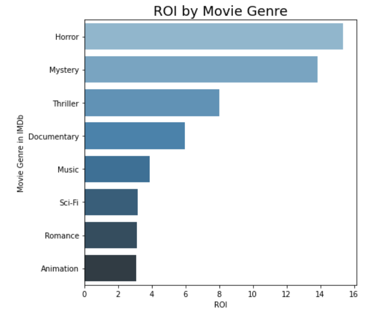

# Xbox to the Box Office: Analysis into the industry of movie-making
 
## Business Problem
Microsoft is trying to enter a very competitive industry where 80% of films produced net negative returns. 

## Data
We used data from *Box Office Mojo*, *The Numbers* movie database, and *IMDb*.
- *The Numbers* provided gross sales and production budgets for each movie. 
- *Box Office Mojo* provided the name of the studio that produced each movie, so that we could select movies from the best performing studios.
- *IMDb* provided us with data on what genres, directors, and popularity of movies.

## Methods
We used descriptive analysis to determine what kinds of movies performed the best under different metrics. We looked at how production budget effected profits. We also categorized movies by genres, directors. Our metrics of success were profits, return on investment, and public interest.

## Results

We found that high budget films led to higher profits

High budget films also led to more public interest

 

We found that the most profitable genres were Animation, Sci-Fi, Adventure, and Action. 

 

We found that Horror, Myster, Thriller, and Documentary films provided the highest return on investment.

 

We found that Jennifer Lee, Chris Buck, Joss Whedon would be great choices for high profit movies.

 

We found Travis Cluff, and Chris Lofing created one extremely successful horror movie and would be a good choice for a high ROI horror film. William Brent would also be good choice for a high ROI horror film.

 

We found that Christopher Nolan or the Russo Brothers would be great choices for a movie that drives public interest in our studios films.

## Conclusions
The results above led us to form three concrete recommendations:
1. The financial analysis illustrated that movies with higher production budgets are making more revenue at the box office. These findings are what led us to form our first recommendation: have a production budget of over a 150 million USD.

2. The analysis into genre provided the basis for our second recommendation: Microsoft studios should produce movies in a diverse range of genres, as well as make multiple movies simultaneously. This strategy will also effectively diversify the risk to Microsoft of this new endeavour.

3. The meta-analysis into which directors produce the best business outcomes concluded in forming our third recomendation: choose directors that drive popularity and profit within the recommended genres to direct those films. Furthermore, develop relationships with high profile directors in the way only a company like Microsoft can.
 

## Next Steps
- Marketing Budget
	- This is a missing metric in our data that has the potential to severely impact the profitability of a film. 
- Popularity
	- This is a metric that we struggled to fully capture in our analysis. Merchandising data would be an interesting approach to solving this problem 
- Alternative Revenue Stream
	- Merchandising, licensing, and streaming revenue data, also has the potential to impact the profitability data.
- 3rd Party Data
	- Once 1st party data is collected, a more accurate and expansive analysis can be produced

### contact info
Greg Burgess [GitHub](https://github.com/gcburgess) [email](mailto:gcburgess@gmail.com)

Nimeshi Fernando [GitHub](https://github.com/nishlikefish) [email](mailto:nimeshifernando@gmail.com)

Tyler Wood [GitHub](https://github.com/twood2015) [email](mailto:t.wood20151996@gmail.com)